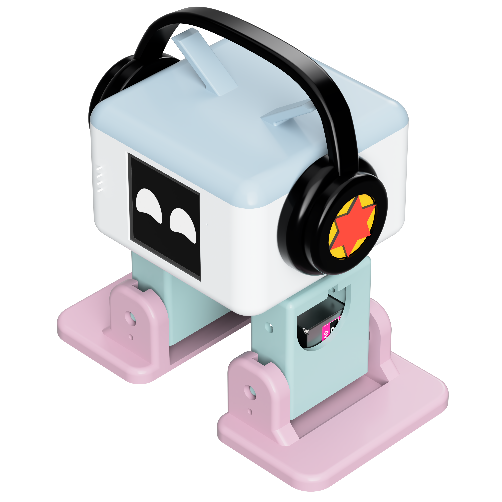

# 闪猫科技AI桌面人形机器人

闪猫科技AI桌面人形机器人 是一个开源的可自行制作的机器人，它有着可爱的外形和丰富的功能，非常适合作为教育工具和个人创客项目。本网站专注于分享闪猫科技AI桌面人形机器人的设计理念和技术原理，帮助更多人能够快速入门桌面AI机器人，让机器人和人工智能快速走进物理世界，走进千家万户，成为人类身边好玩、有趣、实用的超级智能助手。

## 什么是 闪猫科技AI桌面人形机器人？

本机器人灵感来源于由 Camilo Parra Palacio 于 2016 年创建的Otto DIY开源项目，闪猫科技研发团队通过自研端侧算法、外观设计、机械结构等，结合3D打印与‮用通‬电子元件创造万物的理念，让小白用户也可以超低成本仅需30分钟即可手搓一‮专个‬属桌面AI机器人！通过云端一体的架构给予了桌面机器人AI语音对话、AI动作反馈、AI视觉系统等能力，产品深‮融度‬合了‮感情‬陪伴、创客教育、3D打印、AI大模型、具身智能、智能家‮等居‬多元场景，并支持一键‮入接‬闪猫科技AI、小智AI、涂鸦智能、火山引擎等主流AI服务，是一个AI桌面机器人的智能生态硬件平台。我们的目标是大幅降低AI机器人制作的门槛,让AI和机器人真正的进入物理世界，走进千家万户。

### 闪猫科技AI服务已实现功能
- **多种联网方式**：支持 Wi-Fi 和 ML307 Cat.1 4G 连接
- **智能交互**：语音、BOOT 键唤醒和打断，支持点击和长按两种触发方式
- **离线语音唤醒**：使用 ESP-SR 技术，无需联网即可唤醒
- **流式语音对话**：支持 WebSocket 或 UDP 协议的实时对话
- **多语言识别**：支持国语、粤语、英语、日语、韩语、俄语、西班牙语、阿拉伯语、越南语、意大利语、乌克兰语等多种语言（SenseVoice）
- **声纹识别**：可识别是谁在呼叫 AI（3D Speaker 技术）
- **高质量语音合成**：集成火山引擎、 CosyVoice 的大模型等的 TTS
- **AI 大脑**：接入闪猫科技SuperCat LLM2、Qwen、DeepSeek、Doubao 、文心一言等大型语言模型
- **个性化定制**：可配置的提示词和音色，创建自定义角色
- **记忆功能**：具备短期记忆和长期记忆（可选），每轮对话后自我总结
- **视觉显示**：支持 OLED/LCD 显示屏，可显示信号强弱或对话内容
- **表情系统**：LCD 能显示丰富表情图片
- **多语言界面**：支持中文、英文等多种语言

### 小智AI已实现功能
- **多种联网方式**：支持 Wi-Fi 和 ML307 Cat.1 4G 连接
- **智能交互**：语音、BOOT 键唤醒和打断，支持点击和长按两种触发方式
- **离线语音唤醒**：使用 ESP-SR 技术，无需联网即可唤醒
- **流式语音对话**：支持 WebSocket 或 UDP 协议的实时对话
- **多语言识别**：支持国语、粤语、英语、日语、韩语五种语言（SenseVoice）
- **声纹识别**：可识别是谁在呼叫 AI（3D Speaker 技术）
- **高质量语音合成**：集成火山引擎或 CosyVoice 的大模型 TTS
- **AI 大脑**：接入 Qwen、DeepSeek、Doubao 等大型语言模型
- **个性化定制**：可配置的提示词和音色，创建自定义角色
- **记忆功能**：具备短期记忆，每轮对话后自我总结
- **视觉显示**：支持 OLED/LCD 显示屏，可显示信号强弱或对话内容
- **表情系统**：LCD 能显示丰富表情图片
- **多语言界面**：支持中文、英文等多种语言

### 涂鸦智能AI已实现功能
- **智能家居控制**：支持 涂鸦全生态的智能家居语音控制
- **多种联网方式**：支持 Wi-Fi 和 ML307 Cat.1 4G 连接
- **智能交互**：语音、BOOT 键唤醒和打断，支持点击和长按两种触发方式
- **离线语音唤醒**：使用 ESP-SR 技术，无需联网即可唤醒
- **流式语音对话**：支持 WebSocket 或 UDP 协议的实时对话
- **多语言识别**：支持国语、粤语、英语、日语、韩语五种语言（SenseVoice）
- **声纹识别**：可识别是谁在呼叫 AI（3D Speaker 技术）
- **高质量语音合成**：集成火山引擎或 CosyVoice 的大模型 TTS
- **AI 大脑**：接入 Qwen、DeepSeek、Doubao 等大型语言模型
- **个性化定制**：可配置的提示词和音色，创建自定义角色
- **记忆功能**：具备短期记忆，每轮对话后自我总结
- **视觉显示**：支持 OLED/LCD 显示屏，可显示信号强弱或对话内容
- **表情系统**：LCD 能显示丰富表情图片
- **多语言界面**：支持中文、英文等多种语言

### 动作

| 动作类型      | 编号 | 描述            |
| ------------- | ---- | --------------- |
| Walk          | 1    | 行走            |
| Turn          | 2    | 转向            |
| Jump          | 3    | 跳跃            |
| Swing         | 4    | 摇摆            |
| Moonwalk      | 5    | 太空步          |
| Bend          | 6    | 弯曲            |
| ShakeLeg      | 7    | 抖腿            |
| UpDown        | 8    | 上下运动        |
| TiptoeSwing   | 9    | 脚尖摇摆        |
| Jitter        | 10   | 抖动            |
| AscendingTurn | 11   | 上升转弯        |
| Crusaito      | 12   | 十字步/混合步态 |
| Flapping      | 13   | 拍打动作        |

### 动作控制

每个动作执行完成后，机器人会自动回到初始位置(home)，以便于执行下一个动作。

### 唤醒方式：

使用唤醒词 **“Hi 喵喵”** 、**“你好小智”**、**“你好涂鸦”** 等唤醒词唤醒机器人。唤醒词可在编译源码时修改。

### 指令示例：

- **基本控制**：

  - “调高音量”
  - “调亮屏幕”
  - “切换主题暗黑模式/明亮模式”

- **动作控制**：

  - “向前走 / 向前走 5 步 / 快速向前”
  - “跳个舞吧”
  - “做个太空步，速度快一点”
  - “随机做几个动作”
  - “停下来吧”

- **娱乐互动**：
  - “唱个歌吧”
  - “换个悲伤的表情”

### 温馨提示：

- 当机器人在执行动作时，仍可接收语音指令。
- 若背景噪音较大，需提高说话音量以确保指令识别。
- 动作指令实际由AI后台创建并下发任务执行。

## 本站内容

在本网站，你可以找到：

- **完整教程**：从零开始制作自己的 闪猫科技AI桌面人形机器人
- **零部件清单**：所有需要的电子元件和材料
- **组装指南**：详细的步骤图解
- **软件玩法**：详细的MCP服务玩法部署和教程
- **固件指南**：ESP32 编程和 AI 集成教程、涂鸦T5编程和 AI 集成教程等
- **问题解答**：常见问题的解决方案

## 开始制作

准备好制作你自己的闪猫科技AI桌面人形机器人了吗？点击下面的链接开始你的 AI 机器人制作之旅！

  

    

      

        

          <h3>零基础入门</h3>
        

        

          

            从零开始，了解所需材料和基础知识。
          

        

        

          <a href="/docs/getting-started" class="button button--primary button--block">查看入门指南</a>
        

      

    

    

      

        

          <h3>材料准备</h3>
        

        

          

            查看完整的零部件清单和购买建议。
          

        

        

          <a href="/docs/bom" class="button button--primary button--block">查看零部件清单</a>
        

      

    

  

